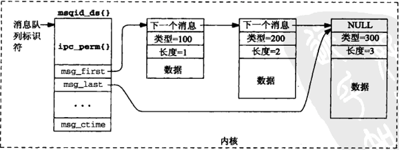

[TOC]


# Chapter 6. System V 消息队列


## 6.1 消息队列的概述


1. 具有足够特权的任何进程都可以往一个给定队列防止一个消息，或者从一个给定队列独处一个消息
2. 对于系统中的每个消息队列，内核维护一个定义在<sys/msg.h>头文件中的信息结构

    ```cpp
    struct msqid_ds
    {
        struct ipc_perm  msg_perm;
        struct msg      *msg_first;  //指向消息队列的第一个消息
        struct msg      *msg_last;   //指向消息队列的最后一个消息
        msglen_t         msg_cbytes; //当前队列所占的字节大小
        msgqnum_t        msg_qnum;   //当前队列中消息的个数
        msglen_t         msg_qbytes; //队列允许占用的最大字节个数
        pid_t            msg_lspid;  //最后一个发送消息的进程pid
        pid_t            msg_lrpid;  //最后一个接收消息的进程pid
        time_t           msg_stime;  //最后一个使用msgsnd()的时间
        time_t           msg_rtime;  //最后一个使用msgrcv()的时间
        time_t           msg_ctime;  //最后一个使用msgctl()的时间
    }
    ```


## 6.2 `msgget` 函数


```cpp

#include <sys/msg.h>
int msgget(key_t key, int oflag);

//该函数用于创建一个新的消息队列或访问一个已经存在的消息队列

```


- 返回值，是一个整数标识符，当其他三个msg函数就用它来指代该队列，他是基于key产生的
- key，  用来标识消息队列的关键字
- oflag，表示读写权限的组合，还可以是`IPC_CREATE`或者`IPC_CREATE | IPC_EXCL` 
- 当创建一个消息队列的时候，msqid_ds结构的如下成员被初始化
    - msg_perm结构的uid和cuid成员被设置成当前进程的有效用户ID，gid和cgid被设置成当前进程的有效组ID
    - oflag中的读写权限位存放在msg_perm.mode中
    - msg_lspid 、msg_lrpid 、msg_qnum 、msg_stime 、msg_rtime 被设置成0
    - msg_ctime被设置成当前时间
    - msg_qbytes被设置成系统限制值


## 6.3 `msgsnd` 函数


```cpp
#incldue <sys/msg.h>
int msgsnd(int msqid, const void *ptr, size_t length, int flag);

//使用msgsnd网消息队列上放置一个消息
```

- msqid, 标志着消息队列，是msgget函数的返回值
- ptr，  指向一个含有一个长整型的数据类型指针,例如：`my_msgbuf`
    
```cpp
struct my_msgbuf
{
    long mtype;
    char mtext[64];
}
```

- length, 表示消息字节长度，例如`sizeof(my_msgbuf) - sizeof(long)`
- flag，   可以是0，也可以是`IPC_NOWAIT`,该标志使得msgsnd调用非阻塞
    - 如果指定队列已有太多的字节，或者系统范围的消息太多，该函数返回EAGAIN错误
    - 如果以上情况有一个存在，但是未指定该标志，调用线程将被投入睡眠，**直到：**
        - 具备存放新消息的空间
        - 由msqid标识的消息队列从系统中删除，返回`EIDRM`错误
        - 调用线程捕获到某个信号被中断，返回`EINTR`错误


## 6.4 `msgrcv` 函数


```cpp
#include <sys/msg.h>
ssize_t msgrcv(int msqid, void *ptr, size_t length, long type, int flag);

//该函数用来从某个消息队列中读出一个消息
```

- 前三个参数与msgsnd函数相同
- type, 指定希望从所指定的队列汇总读出什么样的消息
	- type = 0, 返回消息队列中最早的消息
	- type > 0, 返回消息队列中第一个与type值相等的消息
	- type < 0, 放回消息的类型值小于或者等于type绝对值的第一个消息
- flag，指定所请求的类型的消息不在所指定的队列中时如何处理，
	- 如果设置了`IPC_NOWAIT`位，`msgrcv`函数就立即返回ENOMSG消息
	- 如果没有设置，那么调用者被阻塞到一下情况发生为止：
		- 有一个所请求的类型的消息可以获得
		- msqid标识的消息队列被删除，返回`EINRM`
		- 调用线程被某个捕获的信号中断，返回`EINTR`


## 6.5 `msgctl` 函数

```cpp
#include <sys/msg.h>
int msgctl(int msqid, int cmd, struct msqid_ds *buf);

//该函数提供在一个消息队列上的各种控制操作
```

|命令|操作|
|:----|:----|
|IPC_RMID|从系统中删除msqid表示的消息队列，其上的任何消息被丢弃，该函数的第三个参数被忽略|
|IPC_SET |设置消息队列结构体中的msg_perm.uid,msg_perm.gid,msg_perm.mode和msg_qbytes，其值来自于buf参数指向的结构体相应成员|
|IPC_STAT|通过buf参数给调用者返回与指定消息队列对应的当前结构体|


## 6.6 消息队列的限制

1. 每个消息的最大字节数
2. 任何一个消息队列上的最大字节数
3. 系统范围内的最大消息队列数
4. 系统范围内的最大消息树


