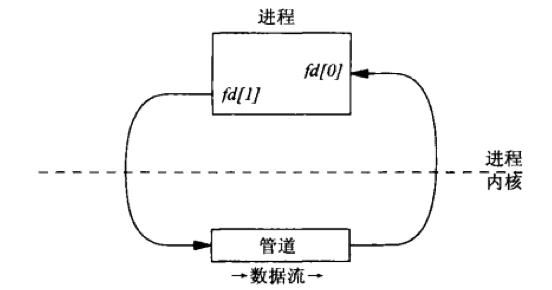

[TOC]

# Chapter 4. 管道

## 4.1 概述


1. 无名管道，尽管对于许多操作来说很有用，但他们根本据现在与没有名字，从而只能由有**亲缘关系**的进程来使用
2. 有名管道，有名管道将以上问题改善

## 4.2 无名管道


### 4.2.1 创建
```cpp
	#include <unistd.h>
	int pipe(int fd[2]);

	//该函数返回两个文件描述符：fd[0]用于读，fd[1]用于写
```
*在有些版本的unix属于全双工*




### 4.2.2 注意

1. 管道流的数据存储于内存
2. 测试管道的大小为 64K
3. 若读一个空管道，则会被阻塞
4. 只写不读，到写满的时候也会被阻塞
5. 没有读端时，如果进行写操作，产生`SIGPIPE`信号，如果忽略该信号或者捕获该信号并从其处理程序返回，则write返回出错，errno设置为`EPIPE`
6. 而没有写端时，读0
7. 空时，读会发生阻塞
8. 满时，写会发生阻塞


## 4.3 `popen`和`pclose	`函数


```cpp
#include <stdio.h>
FILE *popen(const char *command, const char *type);

//command，是一个shell命令(如：cat xxx)
//type,    是一个函数返回的文件指针可读(r) 可写(w)类型
//FILE*,   该函数在调用进程和指定的命令之间创建一个管道，返回一个标准I/O FILE指针

int pclose(FILE *stream);

//pclose函数关闭由popen打开的标准I/O流，等待其中的命令终止，再返回shell的终止状态
```


## 4.4 FIFO 有名管道


### 4.4.1 创建


```cpp
#include <sys/types.h>
#include <sys/stat.h>

int mkfifo(const char *pathname, mode_t mode);

//pathname, 指定FIFO的路径名
//mode,     指定文件权限位
//该函数已经隐含指定了 `O_CREAT | O_EXCL`, 意味着要么创建一个新的FIFO，要么返回一个EEXIST错误
// ---- 先到用 mkfifo, 如果返回EEXIST错误，在调用 open ----
//FIFO 不能同时以读写方式打开，因为他是半双工的
```
*对于管道， write总是往末尾添加数据，read总是从开头返回数据，如果对管道调用 lseek ,返回ESPIPE错误*


### 4.4.2 举例

```cpp
//----------------------服务器(server.c)---------------------
	int		readfd, writefd;
	if ((mkfifo(FIFO1, FILE_MODE) < 0) && (errno != EEXIST))
		err_sys("can't create %s", FIFO1);
	if ((mkfifo(FIFO2, FILE_MODE) < 0) && (errno != EEXIST)) {
		unlink(FIFO1);
		err_sys("can't create %s", FIFO2);
	}

	readfd = Open(FIFO1, O_RDONLY, 0);
	writefd = Open(FIFO2, O_WRONLY, 0);

	server(readfd, writefd); //具体的工作函数
//----------------------客户端(client.c)----------------------
	int		readfd, writefd;

	writefd = Open(FIFO1, O_WRONLY, 0);
	readfd = Open(FIFO2, O_RDONLY, 0);

	client(readfd, writefd);

	Close(readfd);
	Close(writefd);

	Unlink(FIFO1);
	Unlink(FIFO2);
//------------------------------------------------------------
```

## 4.5 无名管道和有名管道（FIFO)的额外属性

### 4.5.1 非阻塞

1. 调用`open`时可以指定`O_NONBLOCK`标志
	
	`writefd = open(FIFO, O_WRONLY | O_NONBLOCK, 0);`

2. 如果一个描述符已经打开，那么可以调用`fcntl`来启用`O_NONBLOCK`标志
	
	**对于无名管道来说，必须使用这种技术，因为无名管道没有`open`调用，也无法指定`O_NONBLOCK`标志**

```cpp
void SetNonblocking(int fd)
{
	int flags;
	if((flags = fcntl(fd, F_GETFL, 0)) < 0)
	{
		//错误提示，并退出
	}
	flags |= O_NONBLOCK;
	if(fcntl(fd, F_SETFL, flags) < 0)
	{
		//错误提示，并退出
	}
	//成功，并退出
}
	
```

### 4.5.2 打开阻塞与非阻塞对两种管道的影响

|当前操作|现有的已打开的操作|阻塞态的返回结果|非阻塞的返回结果|
|:----:|:----|:----|:----|
|open FIFO R|FIFO写端已打开|成功返回        |成功返回|
|           |FIFO写端未打开|阻塞到写端打开为止|成功返回|
|open FIFO W|FIFO读端已打开|成功返回        |成功返回|
|           |FIFO读端未打开|阻塞到读端打开为止|返回ENXIO错误|
|从空管道 or 空FIFO read|写端都已打开|阻塞，知道管道中有数据或者写端关闭|返回EAGAIN错误|
|                     |写端都已关闭|read返回零|read返回零|
|往管道 or FIFO write|读端都已打开|如果写入字节数小于等于管道大小，write操作可以保证是原子的<br>如果大于，则不能保证|a. 如果小于可以保证操作是原子的，否则不能保证<br>如果请求小于管道大小：<br>a. 如果管道剩余空间足够，直接写入<br>b. 如果空间不够，返回EAGAIN错误<br>如果请求大于管道大小：<br>a. 如果管道还有可容纳空间，写入相应字节数并返回<br>b. 如果空间不够，返回EAGAIN错误|
|                   |读端都未打开|a. 给线程产生SIGPIPE <br>b. 如果调用进程既没有捕获也没有忽略该信号，默认终止进程`<br>c. 如果忽略该信号，并从信号处理函数返回，那么write返回一个EPIPE|给线程产生SIGPIPE|


