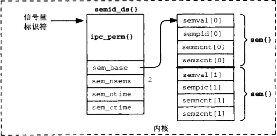

#Chapter 11. System V 信号量
##11.1 概述
- **二值信号量：** 其值或为0或为1的信号量。与互斥锁类似，如果资源被锁住则信号量值为0，如资源可用信号量值为1
- **计数信号量：** 其值在0和某个限制值之间的信号量。信号量的值表示可用资源数

以上两种信号量，**等待(wait)**操作都等待信号量的值变为大于0，然后将它减1.**挂出(post)**操作则将信号量的值加1，从而唤醒等待在该信号量值变为大于0的任意线程

- **计数信号量集：** 一个或多个信号量构成一个集合，其中每个都是计数信号量，每个集合的信号量数存在一个限制，一般在25个的数量级上。*System V 信号量所指的就是计数信号量集，而Posix 信号量指的是单个计数信号量*

对于每个系统中的信号量集，内核维护一个如下的信息结构：

```cpp
	//<sys/sem.h>
	struct semid_ds
	{
		struct ipc_perm;   sem_perm;  // 当前特定信号量的访问权限
		struct sem        *sem_base;  // 指向信号量队列的指针
		ushort             sem_nsems; // 信号量集合中信号量的个数
		time_t             sem_otime; // 最后一次semop()函数操作的时间
		time_t             sem_ctime; // 创建或者 上次 IPC_SET的时间
	 };
	 
	 //每个信号量的结构体描述如下
	 struct sem
	 {
	 	ushort_t semval; //信号量值， 非负
	 	short    sempid; //上次成功使用semop()操作的PID
	 	ushort_t semmcnt;//等待在 semval 增长的进程个数
	 	ushort_t semzcnt;//等待在 semval 变为0的进程个数
	 };
```




## 11.2 `semget` 函数

```cpp
	//semget函数创建一个信号量集或者访问一个已经存在的信号量集
	#include <sys/sem.h>
	int semget(key_t key, int nsems, int oflag);
```

- **返回值，** 是一个**信号量标识符（整数）**，semop和semctl函数将使用它
- nsems, 指定集合中的信号量数，如果只是访问一个信号量集合，这个参数为0，一旦信号量创建完成跟不能改变信号量中这个值
- oflag，可以是SEM_R和SEM_A常值的组合，分别表示读和改，还可以与IPC_CREAT或者IPC_CREAT | IPC_EXCL两个值按位或

当实际操作为创建一个新的信号量集时，相应的**semid_ds**结构的一下成员被初始化

- sem_perm结构的uid和cuid成员被置为调用进程的有效用户ID，gid和cgid成员被设置成调用进程的有效组ID
- oflag参数中的读写权限位存入sem_perm.mode
- sem_otime被置为0， sem_ctime被置为当前时间
- sem_nsems被置为nsems参数的值
- 与之关联的每个信号量sem结构并不会初始化，而是在以**SET_VAL**或者**SETALL**命令调用`semctl`时初始化的

## 11.3 `semop` 函数

```cpp
	//使用semget打开一个信号量集后，对其中一个或者多个信号量的操作就是用semop函数
	#include <sys/sem.h>
	int semop(int semid, struct sembuf *opsptr, size_t nops);
```

- opsptr, 该参数是一个sturct sembuf类型参数，指向一个该类型的数组，结构如下：

```cpp
	struct sembuf
	{
		short sem_num; //信号量的编号，0~nsems-1，
						 //nsems表示创建该信号量时的信号量个数
		short sem_op;  //信号量的操作，小于0，等于0，或者大于0
		short sem_flg; //操作标识：0, IPC_NOWAIT, SEM_UNDO
		// ...
	};
```

- nops，标识opsptr指向的数组的元素个数
- **注意：** sembuf中不止有以上成员，且顺序不一定相等，所以初始化时必须以`Sem.sem_num = 0; ...`


**函数返回错误的集中可能：**

- 使一个信号量操作非阻塞的方法是，在对应的`sembuf`的`sem_flg`成员设置`IPC_NOWAIT`标志，在指定了这个标志后，如果不把线程投入睡眠就完成不了操作的话，`semop`将返回`EAGAIN`错误
- 当调用`semop`时处于睡眠状态，那么他有可能被一个信号处理程序打断这时，该函数返回`EINTR`错误
- 如果该线程被投入睡眠等待某个信号量操作完成时，如果该信号量被其他线程删除，那么该函数被唤醒并返回一个`EIDRM`错误


**关于sem_op参数设置的三种类型的变量的解释：**

1. `sem_op`是**正数**，该操作是将`sem_op`的值加到`semval`上，表示一个释放资源的操作**（V操作）**
2. `sem_op`是**等于0**， 该操作是等待`semval`变为零
	- 如果，没有设置`IPC_NOWAIT`,并且没有捕获信号的操作打断，那么该线程将一直睡眠（`semzcnt++`）直到`semval`变为 0 时返回
	- 如果有`IPC_WAIT`标志，那么立即返回，并设置`EAGAIN`
	- 如果被信号打断，那么立即返回，并设置`EINTR`
	- 如果是信号量被删除，那么立即返回，并设置`EINRM`
3. `sem_op`是**负数**，那么操作将会等到`semval`大于或者等于`sem_op`的绝对值时返回，表示需要分配资源的操作**(P操作）**
	- 如果`semval`小于`sem_op`，那么线程就会投入睡眠状态(`semncnt++`)知道以上条件成立
	- 如果有`IPC_WAIT`标志，那么立即返回，并设置`EAGAIN`
	- 如果被信号打断，那么立即返回，并设置`EINTR`
	- 如果是信号量被删除，那么立即返回，并设置`EINRM`


## 11.4 `semctl` 函数

```cpp
	//semctl函数给一个信号量执行各种控制操作
	#include <sys/sem.h>
	int semctl(int semid, int semnum, int cmd, ... /*union semun arg*/)
```

- **semnum：** 表示要操作的信号量是信号量集合中的第几个成员，0 ~ nsems-1
- **cmd：** 有以下集中操作
	- `GETVAL` 把`semval`的当前值作为函数返回值返回，总为非负数
	- `SETVAL` 把`semval`的值置为第四个参数中的`arg.val`的值
	- `GETPID`,`GETNCNT`,`GETZCNT` 把信号量结构体重的`sempid`,`semncnt`,`senzcnt`的值作为函数返回值返回
	- `GETALL` 把信号量集中的所有`semval`值通过第四个参数`arg.array`指针返回
	- `SETALL` 把信号量集中的所有`semval`值设置为第四个参数`arg.array`指针指向的数组的值
	- `IPC_RMID` 把`semid`指定的信号量集从系统中删除
	- `IPC_SET` 设置`semid_ds`结构中的：`sem_perm.uid`,`sem_perm.gid`和`sem_perm.mode`，这些值来自arg.buf指向的相应成员。`sem_ctime`成员被设置成当前时间
	- `IPC_STAT` 把当前信号量集的`semid_ds`结构返回给`arg.buf`中
- **union semun：** 该参数有应用程序自己定义
	
	```cpp
		union semun
		{
			int             val;
			struct semid_ds *buf;
			struct sem      *array;
		};
	```

## 11.5 举例

*将以上三个函数封装成只有一个信号量的函数*

```cpp
	//-------------------congiures------------------
	static int semid;
	const key_t KEY = 1234; // 
	union semun
	{
		int             val;
		//struct semid_ds *buf;
		//struct sem      *array;
	};
	
	//---------------for init a semaphore-------------
	void sem_init()
	{
		semid = semget(KEY, 1, IPC_CREAT | IPC_EXCL | 0600);
		if(semid == -1)
		{
			semid = semget(KEY, 1, IPC_CREAT | 0600);
			if(semid == -1)
			{
				perror("semget error");
			}
		}
		else
		{
			union semun tmp;
			tmp.val = 1;
			if(semctl(semid, 0, SETVAL, tmp) == -1)
			{
				perror("semctl error");
			}
		}
	}
	
	//-----------------for wait----------------------
	void sem_wait()
	{
		struct sembuf buf;
		buf.sem_num = 0;
		buf.sem_op = -1;
		buf.sem_flg = SEM_UNDO;
		
		if(semop(semid, &buf, 1) == -1)
		{
			perror("semop wait error");
		}
	}
	
	
	//--------------------for post-----------------------
	void sem_post()
	{
		struct sembuf buf;
		buf.sem_num = 0;
		buf.sem_op = 1;
		buf.sem_flg = SEM_UNDO;
		
		if(semop(semid, &buf, 1) == -1)
		{
			perror("semop post error");
		}
	}
	
	//----------------------for destroy--------------------
	void sem_destroy()
	{
		if（semctl(semid, 0, IPC_RMID) == -1)
		{
			perror("semctl destroy error");
		}
	}
	
```


